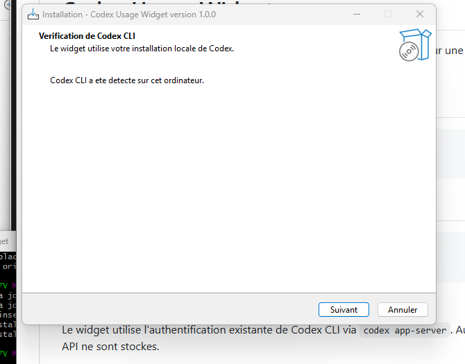

# Codex Usage Widget

[](https://github.com/aboudoux/CodexUsageWidget/releases)
[](https://github.com/aboudoux/CodexUsageWidget/releases/latest)
[](https://dotnet.microsoft.com/)

**Codex Usage Widget** est un petit widget Windows permettant de garder un
oeil sur l'utilisation restante de Codex sans devoir ouvrir la page Analytics
de ChatGPT.

Il reste discrètement au-dessus des autres fenêtres, s'actualise
automatiquement et peut être affiché ou masqué depuis la zone de notification
Windows.

> Ce projet est communautaire et n'est ni développé, ni sponsorisé, ni
> officiellement pris en charge par OpenAI.

## Aperçu

Le widget affiche :

- le pourcentage restant sur la fenêtre **hebdomadaire** ;
- la date et l'heure de réinitialisation de la limite ;
- le solde de crédits disponible, lorsqu'il est fourni par Codex ;
- les tokens cumulés de la conversation locale la plus récente ;
- un indicateur rouge lorsqu'un quota passe sous les **20 %**.

Les valeurs correspondent aux informations visibles dans la page
[Codex Analytics](https://chatgpt.com/codex/cloud/settings/analytics#usage).

## Installation

### Prérequis

- Windows 10 version 1809 ou plus récent, ou Windows 11 ;
- un ordinateur 64 bits ;
- [Codex CLI](https://developers.openai.com/codex/cli) installé ;
- une session Codex authentifiée.

L'application est autonome : il n'est pas nécessaire d'installer .NET
séparément.

### Installer le widget

1. Ouvrir la page des
   [dernières releases](https://github.com/aboudoux/CodexUsageWidget/releases/latest).
2. Télécharger `CodexUsageWidget-Setup-x.y.z.exe`.
3. Lancer l'assistant d'installation.
4. Choisir si le widget doit démarrer automatiquement avec Windows.
5. Lancer le widget à la fin de l'installation.

L'assistant vérifie si Codex CLI est accessible sur l'ordinateur :

<p align="center">
  
</p>

Si Codex CLI n'est pas encore installé, l'installation du widget reste
possible. Il commencera à afficher les données dès que Codex CLI sera installé
et authentifié.

> Windows SmartScreen peut afficher un avertissement tant que l'installateur
> n'est pas signé numériquement. Vérifiez que le fichier provient bien de la
> page Releases de ce dépôt.

## Utilisation

Le widget démarre dans le coin supérieur droit de l'écran. Il peut être déplacé
en maintenant le bouton gauche de la souris sur sa surface.

### Zone de notification

Le widget n'occupe pas de place dans la barre des tâches. Son icône se trouve
dans la zone de notification, près de l'horloge Windows.

- **Clic gauche** : afficher ou masquer le widget.
- **Clic droit** : ouvrir le menu proposant l'actualisation, l'accès à Codex
  Analytics, le démarrage avec Windows et la fermeture de l'application.

Si l'icône n'est pas immédiatement visible, elle peut se trouver dans le menu
des icônes masquées de Windows.

### Actualisation et cache

Les limites sont actualisées toutes les 60 secondes. Le bouton
**Actualiser** permet de déclencher immédiatement une nouvelle lecture.

Si Codex est momentanément indisponible, le widget conserve la dernière mesure
connue et signale que les données affichées proviennent du cache.

### Compteur de tokens

Le compteur de tokens correspond au cumul de la **conversation Codex locale la
plus récente**. Le détail des tokens d'entrée, de cache, de sortie et de
raisonnement est disponible au survol.

Ce nombre est informatif : il ne représente pas un total officiel de tokens
facturés et ne remplace pas le quota hebdomadaire.

## Fonctionnement

Le widget utilise le processus local `codex app-server` et sa méthode
`account/rateLimits/read`. Il récupère ainsi les limites associées à la session
Codex déjà authentifiée sur l'ordinateur.

Le pourcentage affiché est calculé de la manière suivante :

```text
pourcentage restant = 100 - pourcentage utilisé
```

Les informations de tokens sont lues dans les journaux de sessions locales de
Codex, situés dans le dossier utilisateur `.codex/sessions`.

### Confidentialité

- aucune clé API n'est demandée ;
- aucun jeton d'authentification n'est copié ou stocké par le widget ;
- aucune donnée n'est envoyée à un serveur tiers par l'application ;
- seules les informations locales nécessaires à l'affichage sont conservées
  dans `%LOCALAPPDATA%\CodexUsageWidget`.

## Dépannage

### Le widget affiche « Données indisponibles »

Vérifier que Codex CLI est installé et accessible :

```powershell
codex --version
```

Vérifier ensuite que la session est authentifiée :

```powershell
codex login status
```

Après correction, utiliser **Actualiser** dans le widget.

### Les valeurs diffèrent légèrement de la page Analytics

Les données peuvent évoluer pendant l'utilisation de Codex. Actualiser le
widget et la page Analytics au même moment pour les comparer. Le widget affiche
le pourcentage **restant**, alors que l'API locale fournit initialement le
pourcentage utilisé.

### L'icône est absente de la zone de notification

Ouvrir le menu des icônes masquées de Windows. Il est également possible
d'autoriser l'affichage permanent de l'icône dans les paramètres de la barre
des tâches.

## Désinstallation

Le widget peut être supprimé depuis :

```text
Paramètres Windows > Applications > Applications installées
```

La désinstallation arrête le widget, retire son démarrage automatique et
supprime ses paramètres locaux.

## Développement

### Technologies

- .NET 9 ;
- WPF pour l'interface ;
- `NotifyIcon` Windows pour la zone de notification ;
- JSON-RPC via `codex app-server` ;
- MSTest pour les tests ;
- Inno Setup pour l'assistant d'installation.

La solution contient trois projets :

```text
CodexUsageWidget/        Application WPF Windows
CodexUsageWidget.Core/   Lecture Codex, modèles, cache et logique métier
CodexUsageWidget.Tests/  Tests unitaires
```

### Compiler et lancer

Prérequis de développement :

- SDK .NET 9 ;
- Windows 10 ou 11 ;
- Codex CLI installé pour tester la récupération réelle des quotas.

```powershell
dotnet restore
dotnet build
dotnet test
dotnet run --project .\CodexUsageWidget
```

### Publication autonome Windows x64

```powershell
dotnet publish .\CodexUsageWidget\CodexUsageWidget.csproj `
  -c Release `
  -r win-x64 `
  --self-contained true `
  -o .\dist
```

L'exécutable autonome est généré dans `dist\CodexUsageWidget.exe`.

### Créer l'installateur

Installer Inno Setup 6 une seule fois :

```powershell
winget install --exact --id JRSoftware.InnoSetup
```

Puis lancer :

```powershell
.\installer\build-installer.ps1
```

Le script :

1. exécute tous les tests ;
2. publie l'application autonome Windows x64 ;
3. compile l'assistant Inno Setup.

L'installateur final est généré dans `installer-output`.

## Contribuer

Les rapports de bugs et propositions d'amélioration sont les bienvenus dans
les [issues GitHub](https://github.com/aboudoux/CodexUsageWidget/issues).

Pour proposer une modification :

1. créer une branche dédiée ;
2. ajouter ou adapter les tests concernés ;
3. vérifier que `dotnet test` réussit ;
4. ouvrir une pull request avec une description du comportement modifié.

## Licence

Aucune licence n'est actuellement déclarée dans ce dépôt. Avant toute
réutilisation ou redistribution, consultez le propriétaire du projet.
